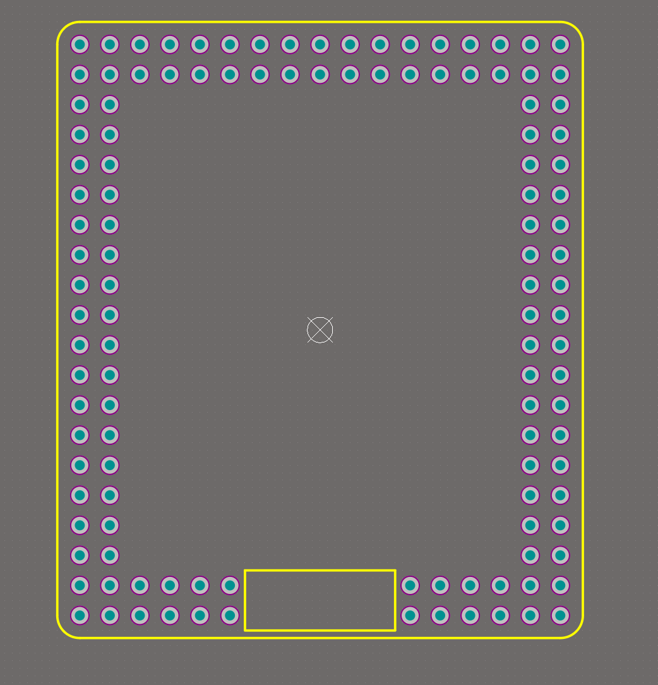
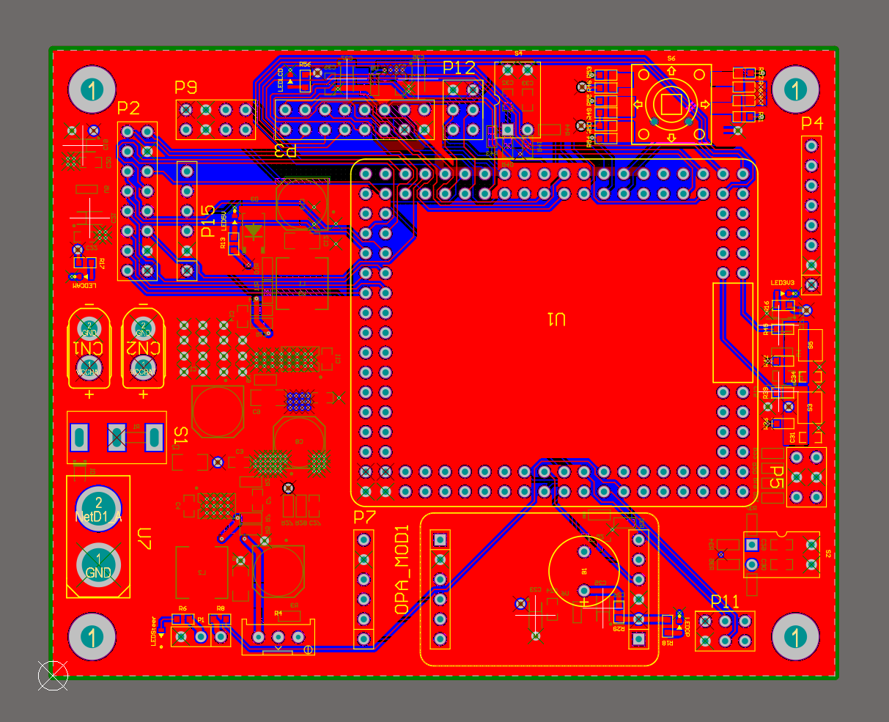
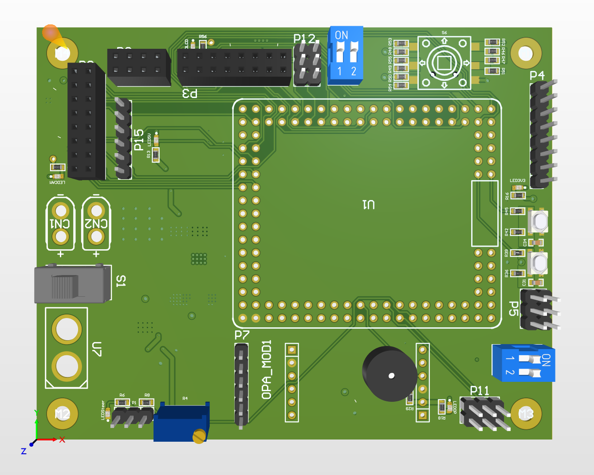

# 硬件技术文档
## ***关于绘制TC264主板的技术总结报告 :***

    此次TC264绘板过程中，一些方面有所收获，相比理论，实践更让人记忆深刻，无论是线宽的选择或是焊盘连接方式都需要在具体操作中选择更加适用于自身，网上的经验积累以及教学操作可以借鉴却不能一味照抄，以下为我在绘制TC264主板时的一些心得体会以及遇到问题的一些解决办法。

* [原理图](#原理图)

* [封装](#封装)

* [布局](#布局)

* [布线](#布线)

* [铺铜](#铺铜)

* [其他](#其他)

### 原理图
    1. 在绘制原理图之前，要先确定电路的功能和结构，选择合适的元器件和封装，以及导入或创建所需的元件库。
    2. 在绘制原理图时，要注意元件的放置和连线，使之符合电气规则和设计规范13。要使用网络标签、端口、总线等工具来简化和清晰地表示电气连接。
    3. 在绘制原理图后，要对原理图进行检查和修改，消除错误和警告25。要使用编译器、设计规则检查等工具来验证原理图的正确性和完整性。
    4.在绘制原理图的过程中，要注意图纸的设置、工作环境的设置、元件属性的设置等细节，以便于后续的仿真和PCB设计。
[***back***](#关于绘制tc264主板的技术总结报告)

### 封装
    可根据实际情况，改变器件封装。例如一些焊盘无需全部保存，可以进行封装更改，但要注意不要误删GND,一些线路需要特别考虑留出走线位置，依据实际情况选择是否保留焊盘或更改封装，更方便走线。也可依据个人习惯绘制封装方便使用。

[***back***](#关于绘制tc264主板的技术总结报告)

### 布局
* 布局很重要，板子的布线好坏决定布局，良好合理的布局，不仅板子美观且稳定；
* 参考成熟的电路板，主芯片尽量放在同一层（减少布线距离以及焊接成本降低）；
* 按照模块分类思想，先主要模块，后次要模块；
1. 交互式布局，利用原理图参考布局；
2. 器件的摆放技巧：旋转、对齐、均称；
3. 显示/隐藏层；
4. 文本的摆放设置；
5. 极坐标摆放元器件；

[***back***](#关于绘制tc264主板的技术总结报告)
### 布线
1. 总体思想(联合各部分，互相协调)，设计好出口与入口；
2. 在空间足够的情况下，可以考虑预留扩展空间；
3. 整体来说：一般先连电源线（最后步可以根据信号线的走线安排，可以减少共振辐射 ，并且尽量走外围）；
4. 局部来说：芯片周边先把信号线连同，最后电源线；
5. 再者芯片间的连线；
6. 一些距离较长的外设跟芯片的连线；
7. 芯片周边应留有较宽的空间，以便于过孔出线；
8. 先连接高频信号线，如晶振等（直线连通），电源地线最后布；

[***back***](#关于绘制tc264主板的技术总结报告)
### 铺铜
    更加结合实际来选择接连方式，例如十字连接和直连，网上内容搜索一般会推荐十字连接，但焊接并不严密，考虑实际更改为直接连接，还有一些泪滴的连接方式等都需要考虑，一节铺铜报错，记得删减孤岛，否则会显示报错。

[***back***](#关于绘制tc264主板的技术总结报告)
### 其他
    按键或一些模块可以考虑独立在主板之外。例如五轴按键可以单独绘制出小板，通过接插件来连接，可重复使用。打板确认好PCB可行，DRC检查，观察3D视图，确认器件无重叠再进行下单。

[***back***](#关于绘制tc264主板的技术总结报告)
