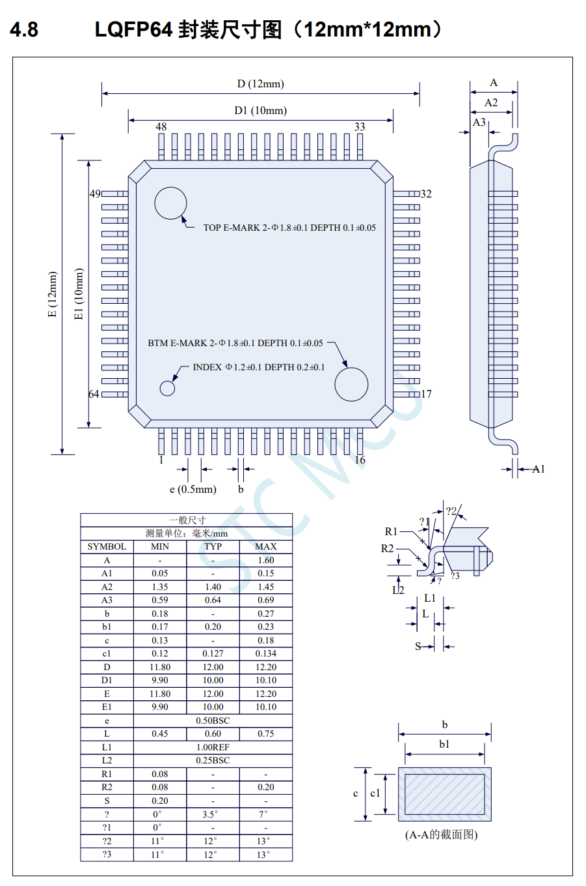
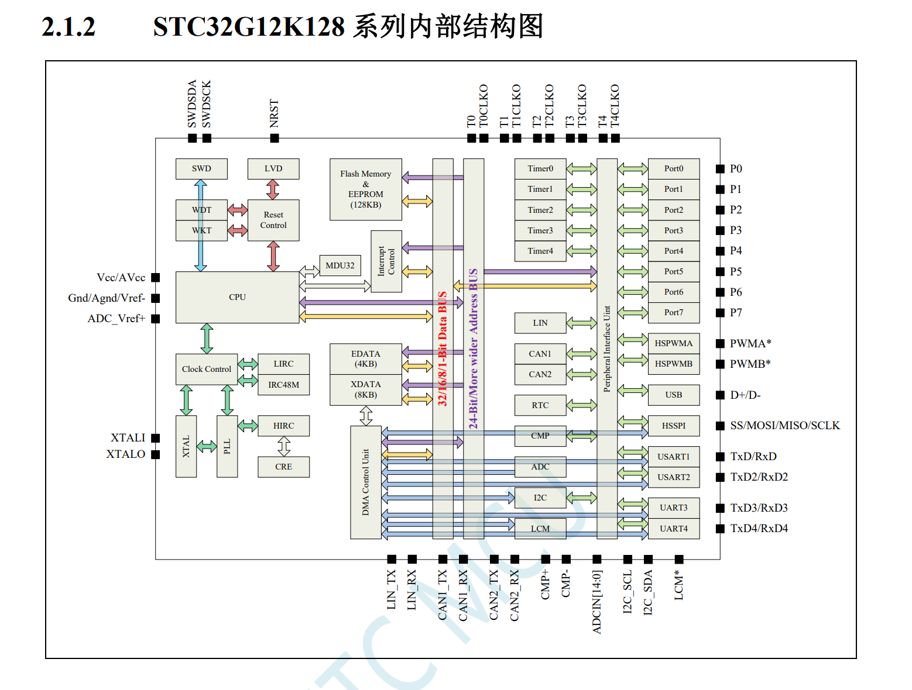
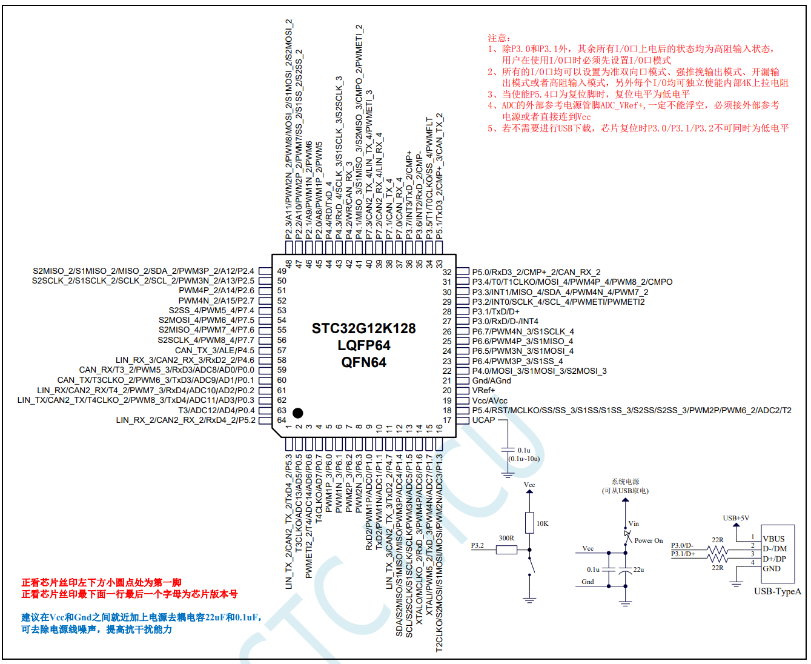

# STC12K128硬件笔记 #
### 笔者：赵文渤

- [STC12K128硬件笔记](#stc12k128硬件笔记)
    - [笔者：赵文渤](#笔者赵文渤)
  - [主控AIO板绘制](#主控aio板绘制)
    - [主控板AIO绘制](#主控板aio绘制)
    - [控制板AIO绘制](#控制板aio绘制)
    - [调试板AIO绘制](#调试板aio绘制)
  - [外设绘制](#外设绘制)
    - [无线串口](#无线串口)
    - [TOF](#tof)
    - [运放](#运放)
    - [屏幕](#屏幕)
    - [按键](#按键)
    - [尾光灯](#尾光灯)
    - [震动马达](#震动马达)
  - [驱动绘制](#驱动绘制)
      - [无刷电机](#无刷电机)
        - [ESC](#esc)
        - [FOC](#foc)
      - [有刷电机](#有刷电机)
        - [驱动板](#驱动板)

## 主控AIO板绘制

[BACK](#stc12k128硬件笔记)

$STC12K128-64P$ 芯片 [技术手册](./资料/STC32G-20231114.pdf)

$STC12K128-64P$ 芯片封装定义图

$$STC12K128-64P 芯片封装定义图$$

$STC12K128-64P$ 芯片结构定义图

$$ STC12K128-64P 芯片结构定义图 $$

$STC12K128-64P$ 芯片引脚定义图

$$STC12K128-64P 芯片引脚定义图$$

### [主控板AIO绘制](./主控AIO/主控板AIO/主控板AIO.md)

### 控制板AIO绘制

### 调试板AIO绘制

## 外设绘制

[BACK](#stc12k128硬件笔记)
 
### 无线串口

### TOF

### 运放

### 屏幕

### 按键

### 尾光灯

### 震动马达

## 驱动绘制

#### 无刷电机

##### ESC

##### FOC

#### 有刷电机

##### 驱动板
